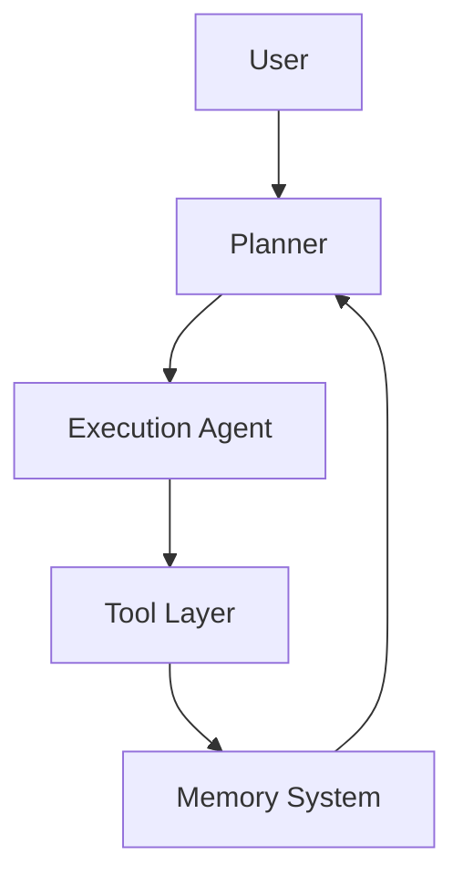
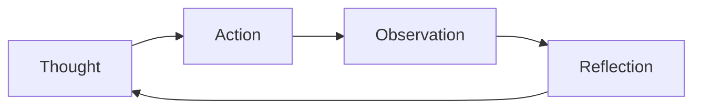
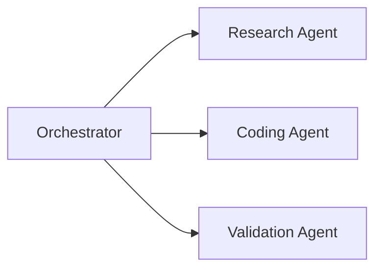

# Building Production-Grade Deep Agents

Deep agents are autonomous AI systems capable of multi-step reasoning, memory persistence, planning, and orchestration.

## Deep Agent Architecture

## ReAct Loop

## Multi-Agent Systems

Deep agents differ from simple chatbots because they maintain memory and continuously adapt workflows.

Key concepts:
- Persistent memory
- Multi-agent orchestration
- Tool execution
- Workflow planning
- Context management

Technologies:
- LangGraph
- LangChain
- MCP
- Vector Databases
- OpenAI APIs
